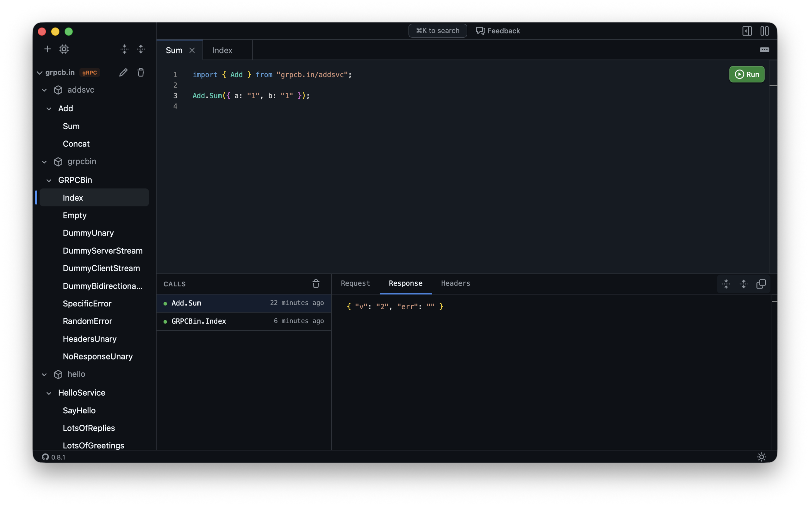

<p align="center">
  <a href="https://kaja.tools"></a>
</p>

<h3 align="center">Explore and call your APIs with code</h3>

<p align="center">
  A code-based UI for exploring and calling <a href="https://grpc.io">gRPC</a> and <a href="https://github.com/twitchtv/twirp">Twirp</a> APIs.
  <br/>
  Write TypeScript to construct requests, call services, and inspect responses — no forms, no clicking through fields.
</p>

<p align="center">
  <a href="https://apps.apple.com/us/app/kaja-for-grpc-and-twirp/id6761604205?mt=12">
    
  </a>
  &nbsp;
  <a href="https://hub.docker.com/r/kajatools/kaja">
    
  </a>
</p>

<p align="center">
  <a href="https://kaja.tools/demo/"><strong>Live Demo</strong></a> ·
  <a href="https://kaja.tools"><strong>Website</strong></a>
</p>

<p align="center">
  <a href="https://github.com/wham/kaja/releases/latest"></a>
  <a href="https://hub.docker.com/r/kajatools/kaja"></a>
  <a href="https://github.com/wham/kaja/blob/main/LICENSE"></a>
</p>

<p align="center">
  <a href="https://kaja.tools/demo/">
    
  </a>
</p>

## Features

- **Code-based** — Write TypeScript to call your APIs. Full autocomplete for services, methods, and message fields.
- **gRPC & Twirp** — Native support for both protocols. Reads your `.proto` files or uses [gRPC server reflection](https://grpc.io/docs/guides/reflection/).
- **macOS & Docker** — Available on the [Mac App Store](https://apps.apple.com/us/app/kaja-for-grpc-and-twirp/id6761604205?mt=12) or as a [Docker container](https://hub.docker.com/r/kajatools/kaja) for any environment.

## Run with Docker

```
docker run --pull always --name kaja -d -p 41520:41520 \
    -v /my_app/proto:/workspace/proto \
    -v /my_app/kaja.json:/workspace/kaja.json \
    --add-host=host.docker.internal:host-gateway kajatools/kaja:latest
```

Then open [http://localhost:41520](http://localhost:41520).

## Configuration

On **macOS**, apps are configured through the UI. The configuration is stored at `~/Library/Application Support/kaja/kaja.json`.

With **Docker**, create a `kaja.json` file and mount it into the container. Every entry in `apps` is one app: a `name` plus one block whose key is the app's type, holding that type's parameters:

```json
{
  "apps": [
    {
      "name": "users",
      "twirp": {
        "url": "http://host.docker.internal:41522",
        "proto_dir": "users/proto"
      }
    },
    {
      "name": "teams",
      "grpc": {
        "url": "host.docker.internal:41523",
        "reflection": true,
        "headers": { "Authorization": "Bearer xxx" }
      }
    }
  ]
}
```

### App options

Each app has a `name` and exactly one typed block:

| Type | Parameters |
|---|---|
| `grpc` | `url`, `proto_dir` (path to `.proto` files), `reflection` (use [gRPC server reflection](https://grpc.io/docs/guides/reflection/) instead of local proto files), `headers` |
| `twirp` | `url`, `proto_dir`, `headers` |

`headers` are sent with each request (e.g. `{"Authorization": "Bearer xxx"}`); for gRPC they are sent as metadata.

#### Migrating from the old format

Earlier versions used a top-level `projects` list with a `protocol` field. Kaja migrates these automatically on load — but to update a file by hand, move each project into `apps` and replace its `protocol`/`url`/`protoDir`/`useReflection` fields with a block named after the type.

Before:

```json
{
  "projects": [
    { "name": "users", "protocol": "RPC_PROTOCOL_TWIRP", "url": "http://host.docker.internal:41522", "protoDir": "users/proto" }
  ]
}
```

After:

```json
{
  "apps": [
    { "name": "users", "twirp": { "url": "http://host.docker.internal:41522", "proto_dir": "users/proto" } }
  ]
}
```

### Docker arguments

| Argument | Description |
|---|---|
| `--pull always` | Always pull the latest image. Kaja is updated frequently. |
| `--name kaja` | Name the container for easy management. |
| `-d` | Run in [detached mode](https://docs.docker.com/engine/reference/run/#detached--d). |
| `-p 41520:41520` | Map the container port. Kaja listens on 41520 by default. |
| `-v .../proto:/workspace/proto` | Mount your [proto_path](https://protobuf.dev/reference/cpp/api-docs/google.protobuf.compiler.command_line_interface/) into the container. |
| `-v .../kaja.json:/workspace/kaja.json` | Mount your [configuration file](#configuration). |
| `--add-host=host.docker.internal:host-gateway` | Access host services from the container. |

## Development

The development scripts require [Go](https://go.dev/doc/install) and [Bun](https://bun.sh/) installed. If not installed, they will offer to install them for you via [Homebrew](https://brew.sh).

- Run in local server: `scripts/server`
- Run in Docker: `scripts/docker`
- Run the desktop app: `scripts/desktop`
- Test UI: `(cd ui && bun test)`
- TSC UI: `(cd ui && bun run tsc)`
- Test server: `(cd server && go test ./... -v)`
- Update demo protos: `scripts/demo-protos` (The demo services are deployed via [kaja/tools/website](github.com/kaja-tools/website))

### Releases

Releases are cut from GitHub — no local build needed. Every push to `main` uploads a new build to TestFlight. To ship a version, run the **release** workflow (Actions → Run workflow):

- `open` (with `patch`/`minor`/`major`) — bumps the version, tags it, and drafts a GitHub Release. TestFlight builds now carry the new version.
- `ship` — publishes the draft Release. Run it when you promote that TestFlight build to the App Store.
