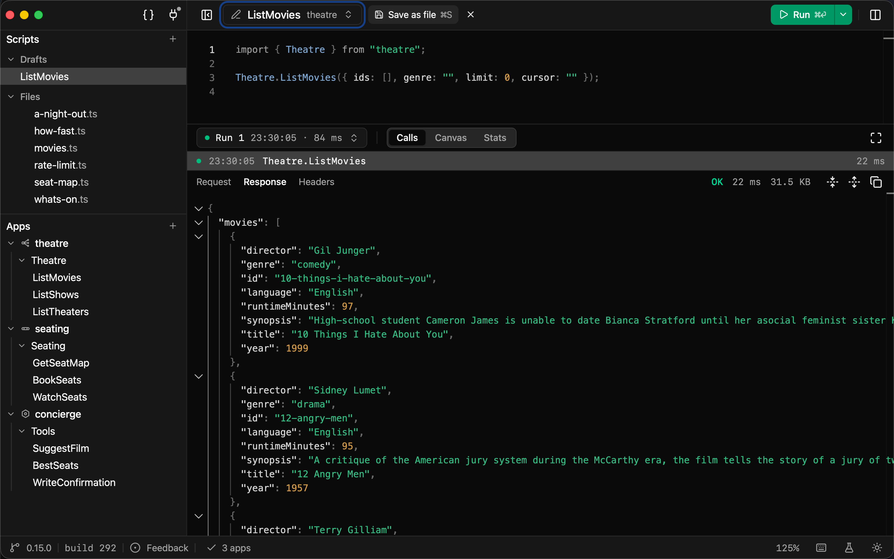

<p align="center">
  <a href="https://kaja.tools"></a>
</p>

<h3 align="center">A canvas for your APIs</h3>

<p align="center">
  An agent calling your APIs leaves you a transcript to trust. Kaja gives it a canvas instead.
  <br/>
  Connect your <a href="https://grpc.io">gRPC</a>, <a href="https://www.openapis.org">OpenAPI</a> and <a href="https://modelcontextprotocol.io">MCP</a> apps, and what your agent does is drawn, logged call by call, and paused for your approval whenever you want one.
</p>

<p align="center">
  <a href="https://apps.apple.com/us/app/kaja-for-grpc-and-twirp/id6761604205?mt=12">
    
  </a>
  &nbsp;
  <a href="https://hub.docker.com/r/kajatools/kaja">
    
  </a>
</p>

<p align="center">
  <a href="https://demo.kaja.tools"><strong>Live Demo</strong></a> ·
  <a href="https://kaja.tools"><strong>Website</strong></a>
</p>

<p align="center">
  <a href="https://github.com/wham/kaja/releases/latest"></a>
  <a href="https://hub.docker.com/r/kajatools/kaja"></a>
  <a href="https://github.com/wham/kaja/blob/main/LICENSE"></a>
</p>

<p align="center">
  <a href="https://demo.kaja.tools">
    
  </a>
</p>

## Features

- **Your agent drives it.** Kaja runs an [MCP](https://modelcontextprotocol.io) server, so your agent reads what your apps expose, writes TypeScript against them, and runs it. Nothing it does is invisible: every run lands in the sidebar next to your own.
- **A canvas, not a transcript.** A script draws what it produced. Tables fill row by row as a loop runs, page and search themselves, and sit alongside text and code.
- **Every call is on the record.** Request, response, headers and duration for each call in a run, whoever pressed Run.
- **Approval when you want it.** A script can hold a call until you approve it, so a write goes out when you say so and not before.
- **gRPC, OpenAPI and MCP.** Read the surface from your `.proto` files, from [gRPC server reflection](https://grpc.io/docs/guides/reflection/), from an OpenAPI document, or from another MCP server. [Twirp](https://github.com/twitchtv/twirp) is supported too.
- **Still yours to drive.** Click a method and Kaja writes you the call, with full autocomplete for apps, methods and message fields.
- **macOS & Docker.** Available on the [Mac App Store](https://apps.apple.com/us/app/kaja-for-grpc-and-twirp/id6761604205?mt=12) or as a [Docker container](https://hub.docker.com/r/kajatools/kaja) for any environment.

## Connect your agent

The MCP server runs inside the desktop app, bound to `127.0.0.1:41521` and guarded by a token. The plug in the status bar carries the connection snippet for your client, ready to paste. For Claude Code it is:

```
claude mcp add --transport http kaja http://127.0.0.1:41521 --header "Authorization: Bearer <token>"
```

Connected, an agent gets an index of every method your apps expose (`list_services`), the TypeScript declarations behind any one of them (`describe_method`, `describe_type`), and the means to run and keep scripts (`run_script`, `create_script`, and the rest of the script tools). A snippet it runs inline goes into a scratch buffer in your sidebar, titled from its own code, so its runs sit in the same console as yours.

## Run with Docker

```
docker run --pull always --name kaja -d -p 41520:41520 \
    -v /my_app/proto:/workspace/proto \
    -v /my_app/kaja.json:/workspace/kaja.json \
    -v /my_app/scripts:/workspace/scripts \
    --add-host=host.docker.internal:host-gateway kajatools/kaja:latest
```

Then open [http://localhost:41520](http://localhost:41520).

The `scripts` mount is optional: `.ts` files in `/workspace/scripts` appear under
**Scripts** in the sidebar, ready to open and run. The container serves its
workspace read-only, so they can't be edited from the browser — check them into
the repository they belong to and mount them in.

## Configuration

On **macOS**, apps are configured through the UI. The configuration is stored at `~/Library/Application Support/kaja/kaja.json`.

With **Docker**, create a `kaja.json` file and mount it into the container. Every entry in `apps` is one app: a `name` plus one block whose key is the app's type, holding that type's parameters:

```json
{
  "apps": [
    {
      "name": "users",
      "twirp": {
        "url": "http://host.docker.internal:41522",
        "proto_dir": "users/proto"
      }
    },
    {
      "name": "teams",
      "grpc": {
        "url": "host.docker.internal:41523",
        "reflection": true,
        "headers": { "Authorization": "Bearer xxx" }
      }
    }
  ]
}
```

The server serves a workspace it does not own, so the UI shows this configuration read-only: it is managed by whoever mounts the file — checked into Git, deployed with the container — and not edited by the engineers running it.

### App options

Each app has a `name` and exactly one typed block:

| Type | Parameters |
|---|---|
| `grpc` | `url`, `proto_dir` (path to `.proto` files), `reflection` (use [gRPC server reflection](https://grpc.io/docs/guides/reflection/) instead of local proto files), `headers` |
| `twirp` | `url`, `proto_dir`, `headers` |

`headers` are sent with each request (e.g. `{"Authorization": "Bearer xxx"}`); for gRPC they are sent as metadata.

#### Migrating from the old format

Earlier versions used a top-level `projects` list with a `protocol` field. Kaja migrates these automatically on load — but to update a file by hand, move each project into `apps` and replace its `protocol`/`url`/`protoDir`/`useReflection` fields with a block named after the type.

Before:

```json
{
  "projects": [
    { "name": "users", "protocol": "RPC_PROTOCOL_TWIRP", "url": "http://host.docker.internal:41522", "protoDir": "users/proto" }
  ]
}
```

After:

```json
{
  "apps": [
    { "name": "users", "twirp": { "url": "http://host.docker.internal:41522", "proto_dir": "users/proto" } }
  ]
}
```

### Docker arguments

| Argument | Description |
|---|---|
| `--pull always` | Always pull the latest image. Kaja is updated frequently. |
| `--name kaja` | Name the container for easy management. |
| `-d` | Run in [detached mode](https://docs.docker.com/engine/reference/run/#detached--d). |
| `-p 41520:41520` | Map the container port. Kaja listens on 41520 by default. |
| `-v .../proto:/workspace/proto` | Mount your [proto_path](https://protobuf.dev/reference/cpp/api-docs/google.protobuf.compiler.command_line_interface/) into the container. |
| `-v .../kaja.json:/workspace/kaja.json` | Mount your [configuration file](#configuration). |
| `--add-host=host.docker.internal:host-gateway` | Access host services from the container. |

## Development

The development scripts require [Go](https://go.dev/doc/install) and [Bun](https://bun.sh/) installed. If not installed, they will offer to install them for you via [Homebrew](https://brew.sh).

- Run in local server: `scripts/server` (pass `--editable` to edit `workspace/kaja.json` from the UI)
- Run in Docker: `scripts/docker`
- Run the desktop app: `scripts/desktop`
- Test UI: `(cd ui && bun test)`
- TSC UI: `(cd ui && bun run tsc)`
- Test server: `(cd server && go test ./... -tags development -v)` — the tag `scripts/server` builds with. Without it the packages embed a production UI bundle, which only `go run cmd/build-ui/main.go` writes.
- Update demo protos: `scripts/demo-protos` — refreshes the `quirks` and `grpcb.in` protos in `workspace/`. The demo *services* live in [kaja-tools/website](https://github.com/kaja-tools/website); `theatre` and `seating` need no protos here, since one is OpenAPI and the other serves gRPC reflection.

### The demo, and the preview apps

Both public deployments serve this repository's own `workspace/` — the demo apps `scripts/server` starts on — baked into the image by the Dockerfile's `demo` stage. **One image, two places it runs**, so a change is clicked through on exactly what it will become:

- **[demo.kaja.tools](https://demo.kaja.tools)** (`deploy/demo/fly.toml`) — deployed by the **main** workflow on every push to `main`, and so from the commit that changed it. One machine stays up, so the first visitor of the day doesn't wait for a cold start.
- **`https://kaja-pr-<number>.fly.dev`** (`deploy/preview/fly.toml`) — one app per pull request, so a change can be clicked through before it is merged. The **preview** workflow rebuilds it on every push and destroys the app when the pull request closes; the URL is a comment on the pull request throughout. A preview runs no machine until someone opens its URL.

The workspace's configuration is read-only, like any server build, so neither ever asks Fly for a disk, and `workspace/scripts/` ships with them — the demo opens with scripts to press Run on.

Fork pull requests are skipped: they have no access to the token. Setting this up in a fresh repository takes a `FLY_API_TOKEN` secret that may create and destroy apps (`fly tokens create org <org>` — an app-scoped deploy token can't create the per-pull-request apps), and optionally a `FLY_ORG` variable if the org isn't `personal`. The demo's own app and certificate are created once, by hand:

```bash
fly apps create kaja-demo
fly certs add demo.kaja.tools --app kaja-demo
```

### Releases

Releases are cut from GitHub — no local build needed. Every push to `main` uploads a new build to TestFlight. To ship a version, run the **release** workflow (Actions → Run workflow):

- `open` (with `patch`/`minor`/`major`) — bumps the version on a branch and opens a PR. **Merge it yourself**: `main` is protected, so the bump has to arrive as a PR and pass the `test` check. TestFlight builds carry the new version from then on.
- `ship` — tags the commit and publishes a GitHub Release for it, with notes covering the whole cycle. Run it when you promote one of those TestFlight builds to the App Store.
