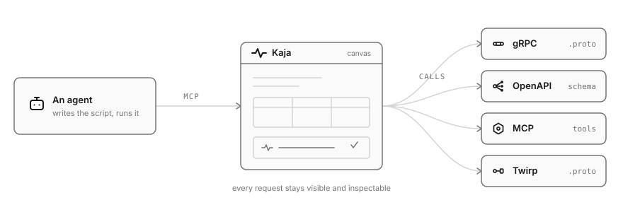

  

  <b>macOS · Docker</b>

<h3 align="center">A canvas for your APIs</h3>

  An API client like Postman or Bruno, except your agent writes the payloads.
   
  Kaja draws the flow, and you can inspect every call.

  
  &nbsp;
  

  <a href="https://kaja.tools/docs"><strong>Documentation</strong></a> ·
  <a href="https://demo.kaja.tools"><strong>Live Demo</strong></a> ·
  <a href="https://kaja.tools"><strong>Website</strong></a>

  
  
  

  

  

## Documentation

Installing Kaja, connecting apps, keeping credentials in variables, writing scripts
and pointing an agent at it are all documented on the website.

<h3 align="center">
  <a href="https://kaja.tools/docs">Read the docs at kaja.tools/docs →</a>
</h3>

|  |  |
| --- | --- |
| **[Installation](https://kaja.tools/docs#installation)** | The Mac App Store build, or one `docker run` with your protos and `kaja.json` mounted |
| **[Apps](https://kaja.tools/docs#apps)** | Connect gRPC, OpenAPI, Twirp and MCP apps, and what each type's block takes |
| **[Variables](https://kaja.tools/docs#variables)** | Named values your scripts and your app configuration both read, with secrets kept out of the file |
| **[Scripts](https://kaja.tools/docs#scripts)** | TypeScript with a typed import for every app you connected, drawing on the canvas |
| **[Agents](https://kaja.tools/docs#agents)** | Point your agent at Kaja's MCP server, and watch every run it makes |

## Development

The development scripts require [Go](https://go.dev/doc/install) and [Bun](https://bun.sh/) installed. If not installed, they will offer to install them for you via [Homebrew](https://brew.sh).

- Run in local server: `scripts/server` (pass `--editable` to edit `workspace/kaja.json` from the UI)
- Run in Docker: `scripts/docker`
- Run the desktop app: `scripts/desktop`. It builds the bundle from `desktop/Taskfile.yml`; `wails3 task --list` in `desktop/` names the steps, and `scripts/desktop-build` makes the one that ships.
- Test UI: `(cd ui && bun test)`
- TSC UI: `(cd ui && bun run tsc)`
- Test server: `(cd server && go test ./... -tags development -v)`. The `development` tag is the one `scripts/server` builds with. Without it the packages embed a production UI bundle, which only `go run cmd/build-ui/main.go` writes.
- Update demo protos: `scripts/demo-protos` refreshes the `quirks` and `grpcb.in` protos in `workspace/`. The demo services themselves live in [kaja-tools/website](https://github.com/kaja-tools/website).
- App Store screenshots: `scripts/demo` walks the installed `/Applications/Kaja.app` through its own story — empty workspace, new app, the tree, a drafted call, a run, the canvas, a performance test, variables, the MCP page — and photographs each at 1440×900 into `desktop/build/screenshots`. It stages a workspace in the app's sandbox container and puts yours back on the way out. The terminal running it needs Accessibility and Screen Recording access.

### Releases

Releases are cut from GitHub, so no local build is needed. Every push to `main` uploads a new build to TestFlight. To ship a version, run the **release** workflow (Actions → Run workflow):

- `open` (with `patch`/`minor`/`major`) bumps the version on a branch and opens a PR. **Merge it yourself**: `main` is protected, so the bump has to arrive as a PR and pass the `test` check. TestFlight builds carry the new version from then on.
- `ship` tags the commit and publishes a GitHub Release for it, with notes covering the whole cycle. Run it when you promote one of those TestFlight builds to the App Store.
