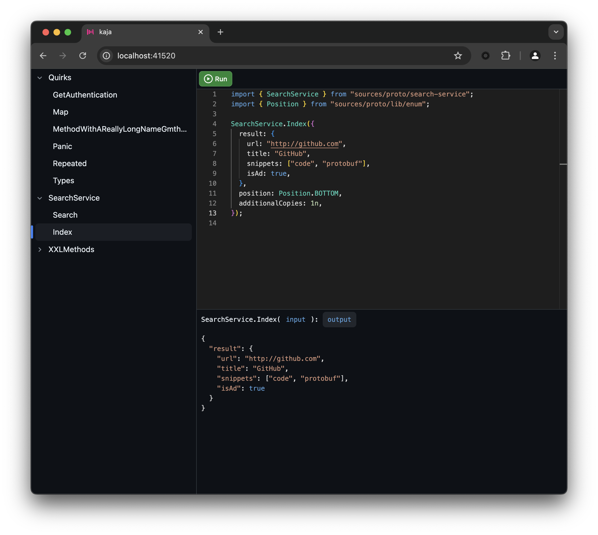

# Introduction

Kaja is an experimental, code-based UI for exploring and calling [Twirp](https://github.com/twitchtv/twirp) and [gRPC](https://grpc.io) APIs. Try the [live demo](https://kaja.tools/demo).



You can embed Kaja into your development workflow as a Docker container. A desktop version is coming later.

```
docker run --pull always --name kaja -d -p 41520:41520 \
    -v /my_app/proto:/workspace/proto \
    -v /my_app/kaja.json:/workspace/kaja.json \
    -e AI_API_KEY="*****"
    --add-host=host.docker.internal:host-gateway kajatools/kaja:latest
```

`docker run` arguments explained:

- `--pull always` - Always pull the latest image from Docker Hub. Kaja is updated frequently.
- `--name kaja` - Name the container. Useful for managing multiple containers.
- `-d` - Run the container in [detached mode](https://docs.docker.com/engine/reference/run/#detached--d).
- `-p 41520:41520` - Expose the container's port 41520 on the host's port 41520. Kaja listens on port 41520 by default.
- `-v /my_app/proto:/workspace/proto` - Mount the `/my_app/proto` directory from the host file system into the container's `/workspace/proto` directory. Kaja will recursively search for `.proto` files in the `/workspace` directory. `/my_app/proto` should be your application's [--proto_path](https://protobuf.dev/reference/cpp/api-docs/google.protobuf.compiler.command_line_interface/), the directory where your `.proto` files are located.
- `-v /my_app/kaja.json:/workspace/kaja.json` - Mount the Kaja [configuration file](#configuration) from the host file system into a predefined location where Kaja expects it.
- `--add-host=host.docker.internal:host-gateway` - Make the host's localhost accessible from the container. This is required for Kaja to call Twirp and gRPC APIs running on the host.
- `-e AI_API_KEY="*****"` - Some [configuration options](#configuration) can also be provided as environment variables.
- `kajatools/kaja:latest` - Kaja is available on [Docker Hub](https://hub.docker.com/r/kajatools/kaja).

A minimal `kaja.json` [configuration file](#configuration) looks like this:

```
{
  projects: [
    {
      "name": "my_app",
      "protocol": "RPC_PROTOCOL_TWIRP",
      "url": "http://host.docker.internal:41522",
    }
  ],
  ai: {
    baseUrl: "https://models.inference.ai.azure.com"
  }
}

```

# Configuration

Kaja is configured with a `kaja.json` file in the `/workspace` directory and/or environment variables.

Supported configuration options:

- `projects`: List of projects to compile and make available for exploring. Each project has the following options:

  - `name`: Display name.
  - `protocol`: Use `RPC_PROTOCOL_TWIRP` for Twirp and `RPC_PROTOCOL_GRPC` for gRPC.
  - `url`: The URL where the application is serving Twirp or gRPC requests.
  - `protoDir`: (Optional) Path to the directory containing `.proto` files. If empty, defaults to `/workspace`.

# Development

Run: `scripts/server`
Test UI: `(cd ui && npm test)`
TSC: `(cd ui && npm run tsc)`
Test server: `(cd server && go test ./... -v)`
