# The console, the run list and the canvas

A short reference for anyone designing on this surface: the model it rests on,
every state it can be in, and what a run actually looks like today. The
architecture is recorded in [AGENTS.md](../AGENTS.md); the performance story is
in [console-at-scale.md](console-at-scale.md). This is the picture.

## The model, in six sentences

1. **Everything you run is a script.** Clicking a method in the tree writes one;
   pressing Run executes it.
2. **A run is the unit** — one press, one duration, one verdict, with everything
   it produced under it. One script can make three calls; three unrelated rows
   say nothing about the thing you pressed.
3. **A run has two views of the same data**, because they want opposite things.
   The **Log** is the flat audit record — one row per call, in wall order, always
   complete, which is what makes it scannable at two hundred rows. The **Canvas**
   is the rendered output — varied, and free to fold what is repetitive.
4. **One segmented control switches them, and nothing else in the header moves.**
   That is the change the split pays for: Request/Response/Headers live down on
   the payload pane, so the header never rearranges as the selection moves.
5. **The console belongs to the file, not the window.** A run lands in the console
   of the script it was pressed on and stays there; switching files switches
   consoles and coming back finds the runs, the selection, the tab and the view as
   they were left.
6. **The canvas can stop the run.** `kaja.ask*` and `kaja.approve` park the script
   in front of a question — the empty space under the block *is* the pause. That
   is what makes the canvas a surface rather than a report.

Two rules follow from the split and are worth stating on their own:

- **A row in the log is a call and only a call.** No disclosure triangles, no
  block rows, no run row. Everything else a run produced is on the canvas.
- **Only the canvas folds.** Consecutive calls to one method become one row there;
  the log stays complete at any length and the tail bar says what is out of sight
  (`13 more`) rather than standing in for it.

## Anatomy

```
┌ console header ─ 35px ────────────────────────────────────────────────────────┐
│ ● Run 3  14:03 · 1.2 s  ⌄ │ [ Log │ Canvas • ] ⌃ ⌄ 2 of 5      ⇱ ⇲ │ ⧉        │
└───────────────────────────────────────────────────────────────────────────────┘
  run pill (dot·number·      view switch     step through   fold/unfold  copy
  agent glyph·time·outcome)  (amber dot =    this file's    the JSON
  → opens the run history    parked run)     runs, ⌃↑ ⌃↓
```

### Log

```
┌───────────────────────────────────────────────────────────────────────────────┐
│ ● 00:17:53  TheKajaTheatre.ListShows                        ▇▇▇▇▇▇   128 ms   │  24px rows,
│ ● 00:17:53  TheKajaTheatre.GetShow      twelve-clocks       ▇▇▇▇▇    112 ms   │  windowed,
│ ● 00:17:53  TheKajaTheatre.GetShow      vera-lune           ▇▇▇▇     96 ms    │  tail-follows
│ ● 00:17:53  TheKajaTheatre.GetShow      midnight-matinee 404 ▇▇▇▇▇   115 ms   │  ← selected
├── tail bar ─ 26px ────────────────────────────────────────────────────────────┤
│ 13 more                              7 not kept   1 error   [ ↓ Latest ]      │
├── payload pane ───────────────────────────────────────────────────────────────┤
│ Request  Response  Headers                              404   115 ms   154 B  │
│ {                                                                             │
│   "detail": "no show \"midnight-matinee\"",                                   │
│   "status": 404                                                               │
│ }                                                                             │
└───────────────────────────────────────────────────────────────────────────────┘
   ↑ status dot · clock · Service.Method · loop key · error code · duration bar
     · duration.  The bar is drawn against the slowest call in the run.
```

The log takes at most 45% of the pane; the payload is the thing being read, the
log is how you choose it. Columns drop as the panel narrows, in this order:
duration bar (500px), loop key (440px), status/size details, clock (360px).

### Canvas

```
┌───────────────────────────────────────────────────────────────────────────────┐
│ Weekly house check — how full every show in the programme is.        ← text   │
│ ┌───────────────────────────────────────────────────────────────────────────┐ │
│ │ ›  ● TheKajaTheatre.ListShows                                     104 ms  │ │ ← call card
│ └───────────────────────────────────────────────────────────────────────────┘ │
│  SHOW                    GENRE     SEATS   FREE   STATE                       │
│  Twelve Clocks           play      160     110    open                ← table │
│  The Cartographer's…     play      160     92     open                        │
│ ┌───────────────────────────────────────────────────────────────────────────┐ │
│ │ ›  ● Seating.GetSeatMap  ×5  twelve-clocks, carto…  ▮▮▮▮▮        596 ms   │ │ ← folded
│ └───────────────────────────────────────────────────────────────────────────┘ │   group
│ ┌ BASH ─────────────────────────────────────────────────────────────────────┐ │
│ │ grpcurl seating.kaja.tools:443 seating.Seating/GetSeatMap                 │ │ ← code
│ └───────────────────────────────────────────────────────────────────────────┘ │
└───────────────────────────────────────────────────────────────────────────────┘
```

Blocks stack in the order they were emitted. There is no positioning, no styling
argument, no `kaja.html` — the block set is closed and tiny, and that is the
guard rather than a starting point.

## Key states

### Run (the pill, and every row of the run history)

| State | Reads as |
| --- | --- |
| In flight | spinner in place of the dot, elapsed counting up in tenths (`00:14 · 4.2s`) |
| Parked on a question | amber border, amber dot, `14:03 · waiting` |
| Succeeded | emerald dot, `14:03 · 1.2 s` (wall time for the whole script) |
| Failed | red dot, `14:03 · failed` — a run's status is the worst status it contains |
| Run by an agent | a `Bot` glyph beside the number; a console holds runs of both |
| Read back from an earlier session | dimmed to 70%, dated rather than clocked |
| Payloads expired | the run is still there; the pane says `Response no longer kept — run to see it live` |

Runs are numbered, not named (`Run 3`) — a console holds one script's runs, so
naming each after the script says the same thing on every row. The number is the
run's own, so it survives the oldest runs being trimmed.

### Call row

| State | Reads as |
| --- | --- |
| Pending / streaming | spinner, elapsed counting up |
| Success | emerald dot, duration + bar |
| Error | red dot, error code beside the name — the **HTTP status** for an HTTP app (`404`), the gRPC/Twirp code otherwise (`UNKNOWN`) |
| Selected | `bg-accent`; picking a row stops the log following |
| Payload let go | row stays, pane says `Payload let go to keep this run bounded` |

### Tail bar (only appears when it has something to say)

| State | Reads as |
| --- | --- |
| Waiting | amber left border, `Waiting for an answer`, `Go to canvas` |
| Script failed | destructive left border, `Script failed`, `Go to canvas` |
| Counts | `13 more` below the fold · `7 not kept` · `1 error` · `↓ Latest` when the log has been scrolled off the bottom |

### Payload pane

Tabs are Request / Response / Headers, and the right-hand readout is
`OK · 104 ms · 2.8 KB` (`Streaming` adds `N messages`). Without the readout a
successful call and an empty one look the same. A failed call adds a
`POST <url>` band above the body. Headers split into **Upstream** (what Kaja
exchanged with the API, including the request line) and **Transport** (browser ↔
Kaja) whenever an in-process app reports upstream headers.

### Empty and edge states

| Situation | What is shown |
| --- | --- |
| Nothing has ever been run | one line: `Run a script to see its calls here — ⌘⏎`. No header, no tabs. |
| Run started, no call yet | `Waiting for the first call…` |
| Run produced nothing at all | canvas says `This run drew nothing.` (a run that only made calls opens on the Log, and its canvas is the call cards) |
| Stored run whose payloads aged out | `Canvas no longer kept — run to see it live` |

## Everything that can appear on the canvas

Nine kinds, and their variants. The first five are what a script draws; the last
four are what the console adds around them.

**1. Text** — `kaja.text(...)`. One paragraph, pre-wrapped, no styling.

**2. Code** — `kaja.code(text, language?)`. Bordered card; the language becomes a
small uppercase strip along the top, absent when no language was given.

**3. Table** — `kaja.table(columns, rows?, { pageSize })`. The richest block:

| Variant | What appears |
| --- | --- |
| Static, fits a page | header + rows, nothing else |
| Static, longer than a page | a controls bar: search, `1–50 of 120`, pager |
| Live (rows are a generator) | same bar, count reads `1–4 · 4 loaded`, Next pulls the source |
| Search bound to the source | placeholder `Search…`; a new search restarts the source |
| Search over loaded rows | placeholder `Search loaded rows…`; summary says `… matching, of N loaded`; never fetches |
| Pulling | spinner in the bar; Next disabled |
| Empty | `No rows yet…` / `No rows match.` / `Loading…` |
| Failed pull | destructive line under the rows with `Retry` |
| Read back from the store | `1–4 loaded — run to load the rest`; the source is a closure and cannot be stored |
| Row still being filled | a row is written when work starts (`…`) and rewritten with `.update(...)`; short rows are padded, never ragged |

**4. Ask** — `kaja.askStr` / `askInt` / `askSelect`. Amber left border while the
run is parked on it, neutral card once settled.

| Variant | What appears |
| --- | --- |
| `str` / `int`, waiting | question + one field with `⏎`; an int refuses `3.5` and states why under the field |
| `select`, waiting | question + a listbox of the offered labels, walkable with the arrow keys |
| Answered | question dimmed, the answer below it |
| Cancelled | `Cancelled`, italic — the script stopped there |

**5. Approve** — `kaja.approve(SomeService.Method({...}))`. An ask about a call
that has not happened yet: it holds the whole request, because what makes a call
worth approving is what is in it.

| Variant | What appears |
| --- | --- |
| Waiting | amber block: shield glyph + `Service.Method`, the request as JSON, then **Approve** · **Approve all Service.Method** · **Stop**. No button takes focus |
| Approved | `Approved` |
| Approved, standing | `Approved — and every Service.Method after it`; later calls to that method draw no block |
| Not approved | `Not approved — the script stopped here`, italic |

**6. Call card** — one line per call that isn't folded: chevron, status dot,
`Service.Method`, an error-code pill when it failed, duration. Clicking it selects
that call's row in the log and switches views; the payload is never unrolled into
the flow.

**7. Folded call group** — three or more *consecutive* calls to one method
(`MIN_FOLD = 3`). The name once, `×8`, the loop keys that tell them apart
(`twelve-clocks, cartographers-daughter +6`), a tick per call drawn against the
slowest in the group, `1 error` when any failed, and the group's **wall** time.
Each tick is a way into that call's row; the tick for the row the log is pointing
at is lit. Past 32 calls the strip draws what fits and says `+N`; below ~520px it
goes away and the name is the only way in.

**8. Script failure** — a destructive block at the point the script threw. This is
the only kind of log-message item the console produces today; `console.log` from a
script does not draw on the canvas.

**9. Notices** — the canvas's own empty and expired states, centred.

## Which view a run opens in

A run that drew something opens on its **canvas** — it was executed for its
output, and the log is where you go when the output is wrong. A run that only
made calls opens on its **log**. An explicit choice outranks that and sticks per
file: debugging is a mode, not a click.

## Rules a redesign has to keep

- **Amber means "needs you"**, and it is the whole signal for a parked run: the
  block, the Canvas tab's dot, the tail bar, the run pill, and the ring on the
  sidebar row. Emerald is success, destructive is failure, muted is pending.
- **The log follows the run like a terminal**, and stops the moment you scroll off
  the bottom. Pressing Run starts it again.
- **Nothing in the log is ever collapsed or summarised away.** Where it stops
  being complete it says so.
- **No index over the content.** A timeline strip above the canvas, or a list of
  block rows, is the same double statement the view split removed.
- **Retention is stated, never silent**: 25 runs per file, 20,000 rows per run,
  the newest 500 payloads per file, 50 files, and 3 runs / 7 days of payloads
  carried across sessions.

## The real thing

All of these are the current build, driven against the demo workspace
(`workspace/kaja.json`) — the theatre OpenAPI app, the seating gRPC app and
grpcb.in.

### Log

Nothing has been run yet — the console is one line, with no header to speak of:

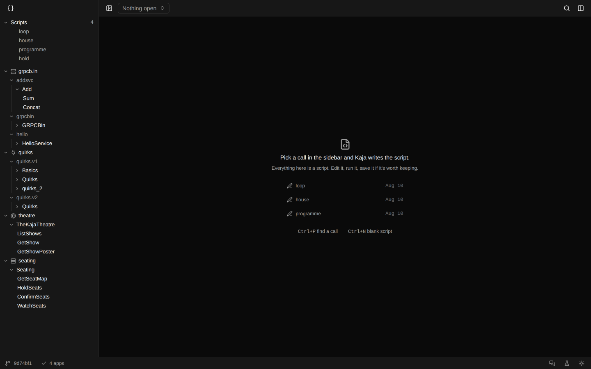

A run in flight: spinners on the rows that haven't come back, the elapsed clock
counting up in the run pill, Run replaced by Stop:


Settled. Nine calls, the loop key telling them apart, the duration bars drawn
against the slowest, and the one that failed selected — the 404 body is the
payload, not the gRPC envelope that carried it:

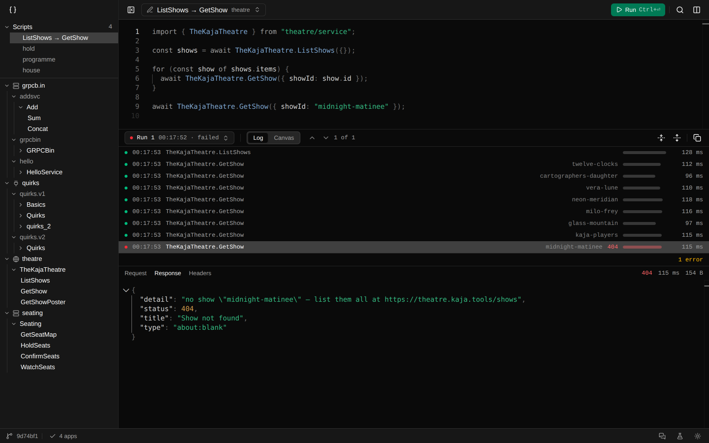

The Headers tab of that same call, split into the upstream hop and the transport
hop:

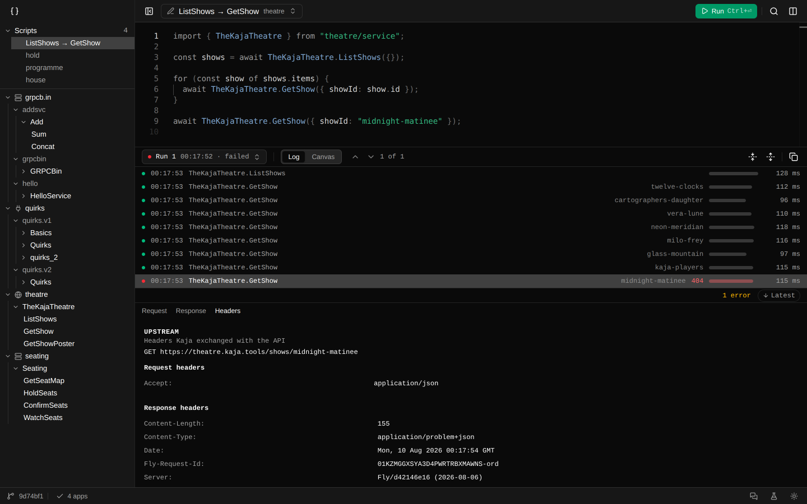

The run history hangs off the pill — this file's runs, newest first, dated once
the list moves off today:

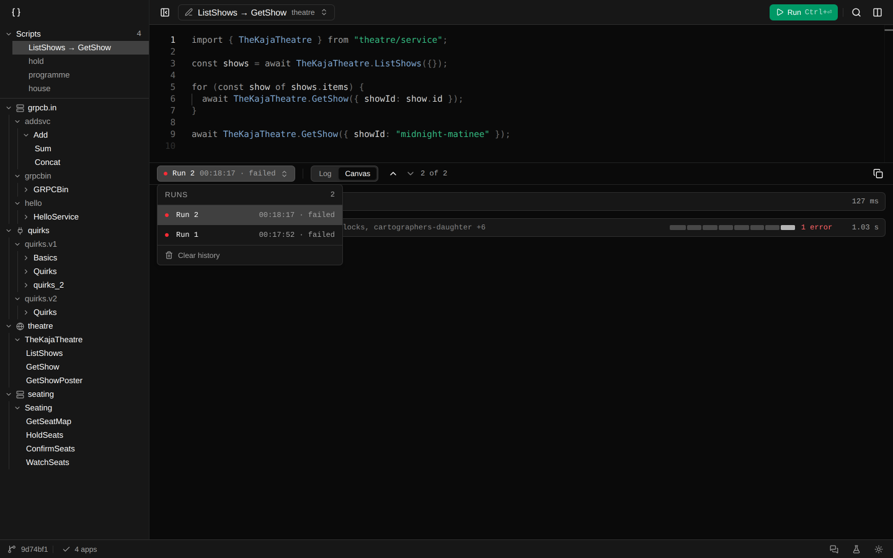

A long run, scrolled back: the tail bar counts what is below, what was dropped
and how many failed, and offers the way back to the tail:

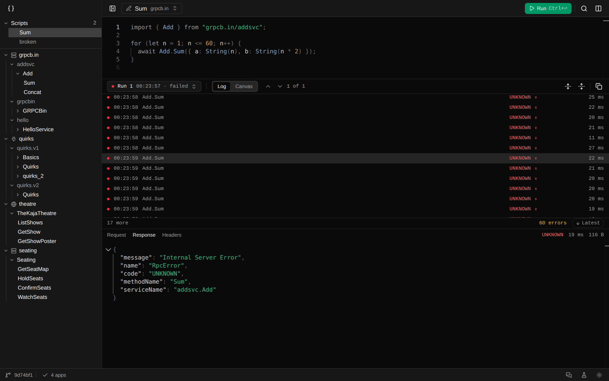

### Canvas

The same nine-call run as a canvas: one card for the call that stands alone, one
folded row for the loop, with a tick per call:

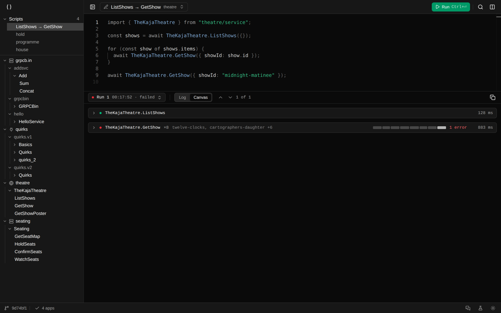

A script written for its output: text, a call, a table filled in row by row as
the loop runs, the loop folded under it, and a code block:

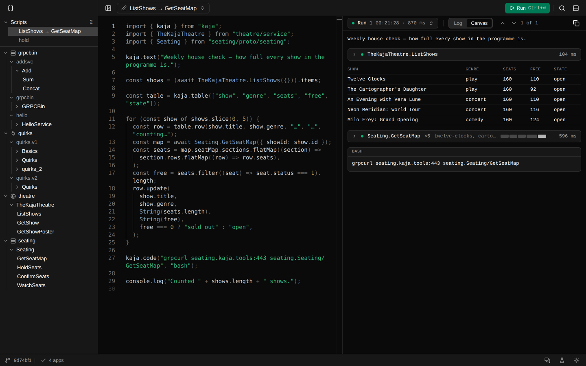

A live table — rows come from a generator, so the bar carries a search, a
`1–4 · 4 loaded` count and a pager that pulls the source when you page past what
is loaded:

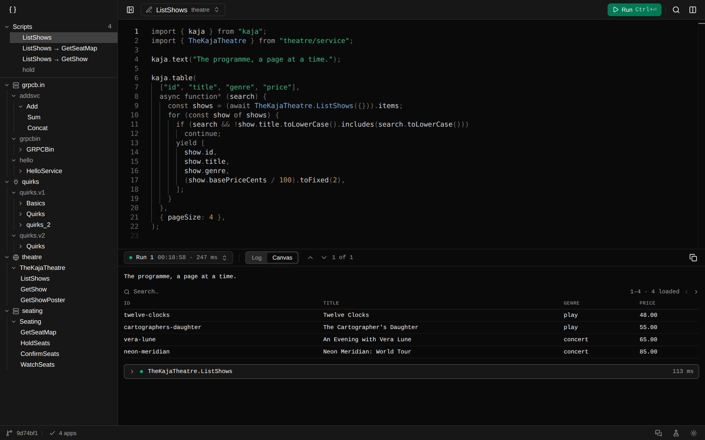

A run parked on a select. The canvas stops there; the empty space under it is the
pause:

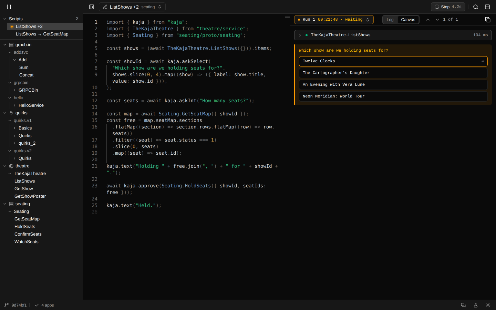

The same moment on the Log — the run is parked, but the log stays readable, and
three things say where the question is:

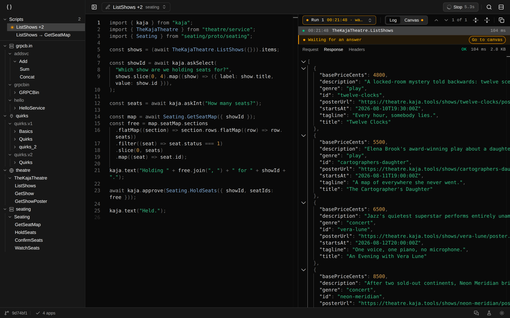

An int that will not take `3.5`. The check is here, in front of the person who
typed it, rather than a line later in the script:

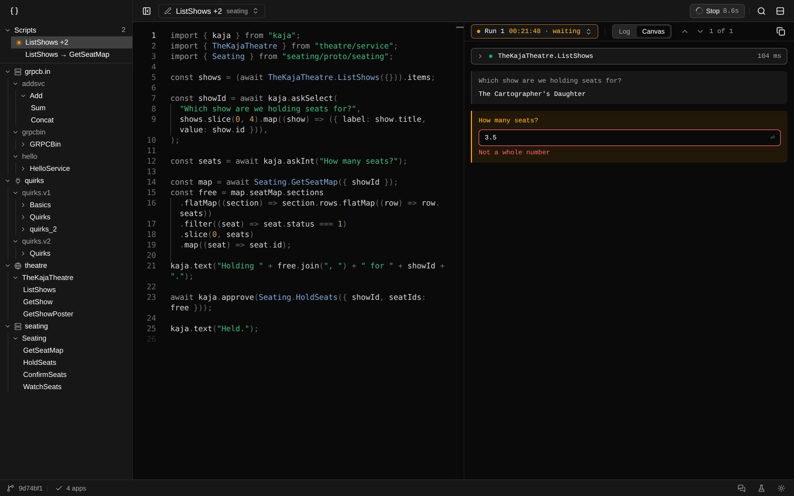

A call held for approval — the whole request, and a third button that says
exactly what it covers:

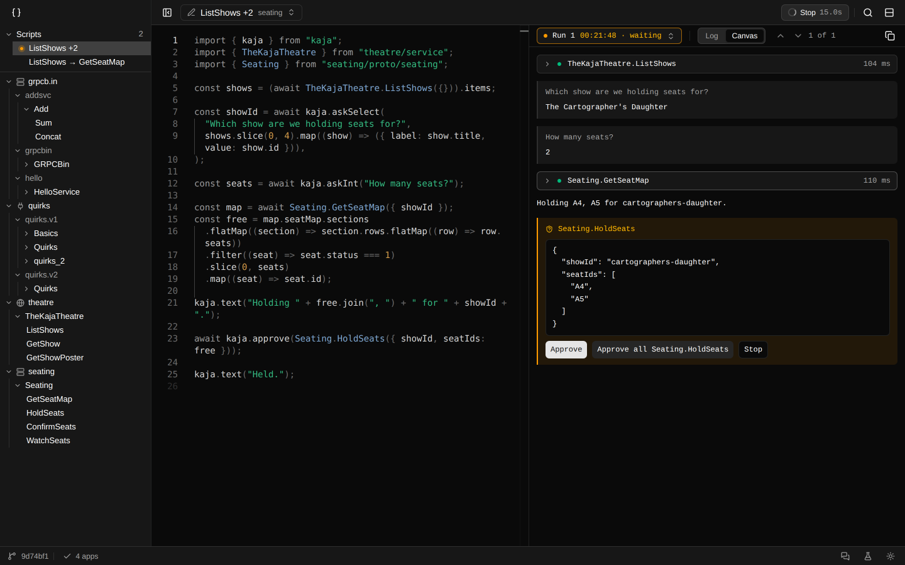

…and settled, with the call it released below it:

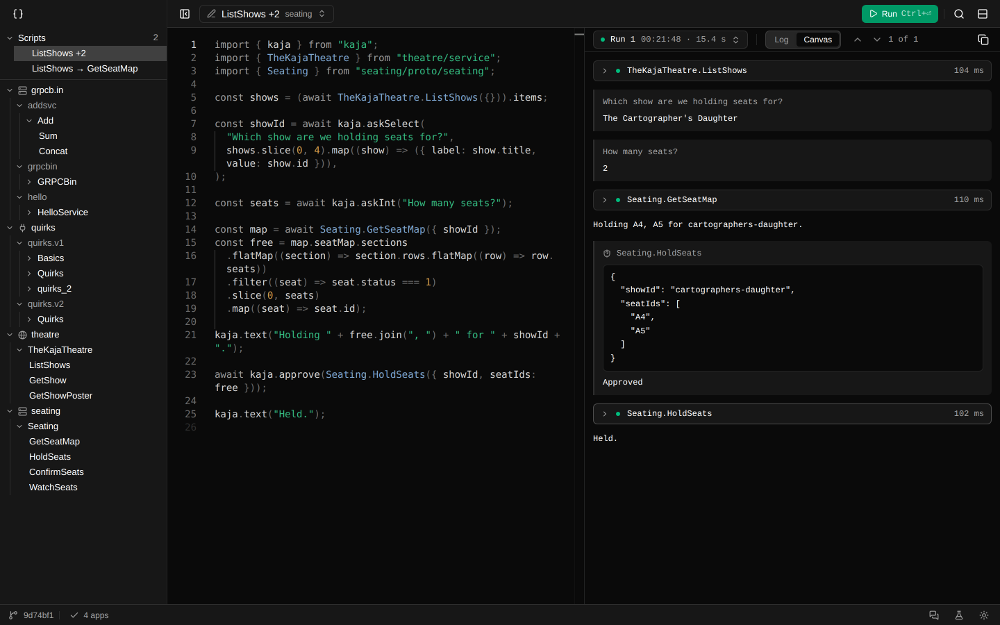

A script that threw: the failure lands on the canvas where it happened…

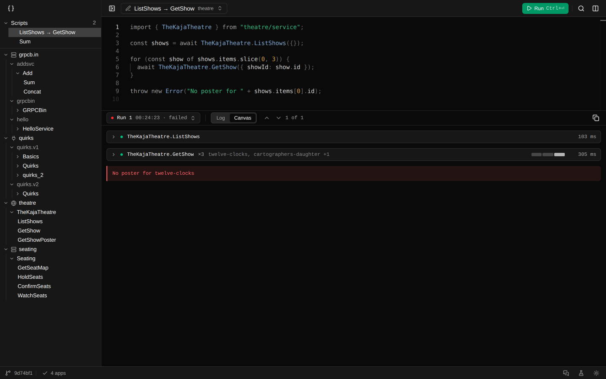

…and the log says so in the tail bar, with the way over. (Light theme — the whole
surface is theme-aware.)

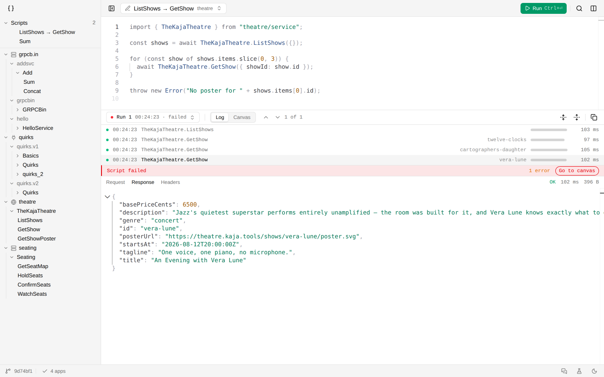
